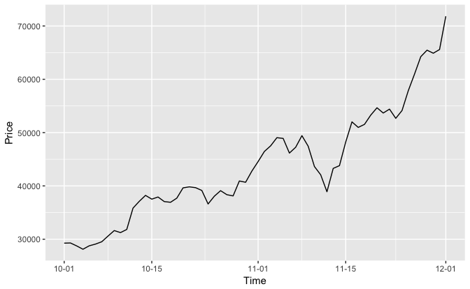

## R `coindesk` Package : A Tool for Bitcoin Index Price Query and Visualization

The `coindesk` package contains the following functions. All the functions are powered by [CoinDesk](https://www.coindesk.com/price/).

-   `bpi_price()`
-   `get_currency_code()`
-   `get_history()`
-   `plot_bpi()`

Type `devtools::install_github('fanymiles/coindesk')` to install and use the package.

`bpi_price()` Function
----------------------

The `bpi_price()` function query the current price of BPI. Currency can be specified by adding a list of currency codes. The return dataframe consists of four columns data including currency code, description, float rate and time.

Example 1: query current BPI
----------------------------

``` r
library(coindesk)
library(httr)
library(jsonlite)
# query current Bitcoin Price Index default in USD
bpi_price()
```

    ##   code          description     rate                      time
    ## 1  USD United States Dollar 16580.59 Dec 14, 2017 22:29:00 UTC

``` r
# query current BPI in EUR
bpi_price(currency = 'EUR')
```

    ##   code description    rate                      time
    ## 1  EUR        Euro 14077.8 Dec 14, 2017 22:29:00 UTC

This call of the function will return a dataframe consists of BPI in the currency specified by the user (defaul in USD).

Example 2: query current BPI in a list of currency
--------------------------------------------------

``` r
library(coindesk)
library(httr)
library(jsonlite)
# query current Bitcoin Price Index in a list of currencies
currency <- c("EUR","CNY","AUD")
bpi_price(currency)
```

    ##   code       description    rate                      time
    ## 1  EUR              Euro 14077.8 Dec 14, 2017 22:29:00 UTC
    ## 2  CNY      Chinese Yuan 40202.5 Dec 14, 2017 22:29:00 UTC
    ## 3  AUD Australian Dollar 21626.9 Dec 14, 2017 22:29:00 UTC

This call will return a dataframe consists of BPI in a list of currencies.

`get_currency_code()` Function
------------------------------

The `get_currency_code()` function is used to show the currency codes used for BPI query. It consists of 167 contries' currency codes.

Example
-------

``` r
library(coindesk)
# check and get currency code
currency <- get_currency_code()
# check the first ten currencies
head(currency, 10)
```

    ##    currency                       country
    ## 1       AED   United Arab Emirates Dirham
    ## 2       AFN                Afghan Afghani
    ## 3       ALL                  Albanian Lek
    ## 4       AMD                 Armenian Dram
    ## 5       ANG Netherlands Antillean Guilder
    ## 6       AOA                Angolan Kwanza
    ## 7       ARS                Argentine Peso
    ## 8       AUD             Australian Dollar
    ## 9       AWG                 Aruban Florin
    ## 10      AZN             Azerbaijani Manat

``` r
# check the last ten currencies
tail(currency, 10)
```

    ##     currency                   country
    ## 158      XBT                   Bitcoin
    ## 159      XCD     East Caribbean Dollar
    ## 160      XDR    Special Drawing Rights
    ## 161      XOF           CFA Franc BCEAO
    ## 162      XPF                 CFP Franc
    ## 163      YER               Yemeni Rial
    ## 164      ZAR        South African Rand
    ## 165      ZMK Zambian Kwacha (pre-2013)
    ## 166      ZMW            Zambian Kwacha
    ## 167      ZWL         Zimbabwean Dollar

``` r
# check the number of supported currencies (167 countries in total)
length(currency$currency) 
```

    ## [1] 167

`get_history()` Function
------------------------

This function will return the history BPI. Currency, start date, end date can be specified in the query using parameter `currency`, `start` and `end`. The default currency is USD and the default time duration is last one month. The function will return yesterday's BPI if `yesterday` parameter is set to `TRUE`

Example 1: query past one month data
------------------------------------

``` r
library(coindesk)
library(httr)
library(jsonlite)
# get past 31 days BPI in CNY
past_month <- get_history(currency = 'CNY')
# check the head of past month data
head(past_month, 10)
```

    ##               price
    ## 2017-11-13 43279.98
    ## 2017-11-14 43801.97
    ## 2017-11-15 48232.47
    ## 2017-11-16 52012.29
    ## 2017-11-17 50973.77
    ## 2017-11-18 51542.06
    ## 2017-11-19 53279.46
    ## 2017-11-20 54656.35
    ## 2017-11-21 53673.79
    ## 2017-11-22 54403.23

``` r
# check the tail of past month data
tail(past_month, 10)
```

    ##                price
    ## 2017-12-04  76852.01
    ## 2017-12-05  77398.88
    ## 2017-12-06  90679.55
    ## 2017-12-07 111589.98
    ## 2017-12-08 106233.20
    ## 2017-12-09  98676.77
    ## 2017-12-10  99525.10
    ## 2017-12-11 110642.88
    ## 2017-12-12 113732.67
    ## 2017-12-13 108580.29

``` r
# length of the past_month (31 days)
length(past_month$price)
```

    ## [1] 31

Example 2: query data by specifying date
----------------------------------------

``` r
library(coindesk)
library(httr)
library(jsonlite)
# get historical BPI from Oct.1 2017 to Dec.1 2017 in EUR
randomDate <- get_history(currency = 'EUR', start = '2017-10-01', end = '2017-12-01')
# check the head of data selected from random date
head(randomDate, 10)
```

    ##               price
    ## 2017-10-01 3721.965
    ## 2017-10-02 3753.423
    ## 2017-10-03 3680.799
    ## 2017-10-04 3594.406
    ## 2017-10-05 3691.032
    ## 2017-10-06 3724.777
    ## 2017-10-07 3782.638
    ## 2017-10-08 3916.612
    ## 2017-10-09 4065.171
    ## 2017-10-10 4026.574

``` r
# check the tail of data selected from random date
tail(randomDate, 10)
```

    ##               price
    ## 2017-11-22 6964.145
    ## 2017-11-23 6753.021
    ## 2017-11-24 6873.850
    ## 2017-11-25 7344.884
    ## 2017-11-26 7814.236
    ## 2017-11-27 8184.176
    ## 2017-11-28 8363.368
    ## 2017-11-29 8284.045
    ## 2017-11-30 8340.233
    ## 2017-12-01 9131.057

Example 3: query yesterday data
-------------------------------

``` r
library(coindesk)
library(httr)
library(jsonlite)
# get yesterday BPI (default in USD)
get_history(yesterday = TRUE)
```

    ##              price
    ## 2017-12-13 16407.2

``` r
# get yesterday BPI, in CNY
get_history(currency = 'CNY', yesterday = TRUE)
```

    ##               price
    ## 2017-12-13 108580.3

`plot_bpi()` Function
---------------------

This function will plot the historical BPI data. The parameter `df` is the dataframe that returned from the `get_history()` function.

Example
-------

``` r
library(coindesk)
library(httr)
library(jsonlite)
# get a sample query result from the package (price in CNY)
sample <- coindesk::df
# check the head of sample data in the package (price in CNY)
head(sample, 10)
```

    ##               price
    ## 2017-10-01 29264.49
    ## 2017-10-02 29295.76
    ## 2017-10-03 28743.09
    ## 2017-10-04 28120.57
    ## 2017-10-05 28764.04
    ## 2017-10-06 29084.20
    ## 2017-10-07 29521.36
    ## 2017-10-08 30583.29
    ## 2017-10-09 31622.87
    ## 2017-10-10 31243.36

``` r
# plot the time and the price of the sample result (price in CNY)
plot_bpi(coindesk::df)
```


